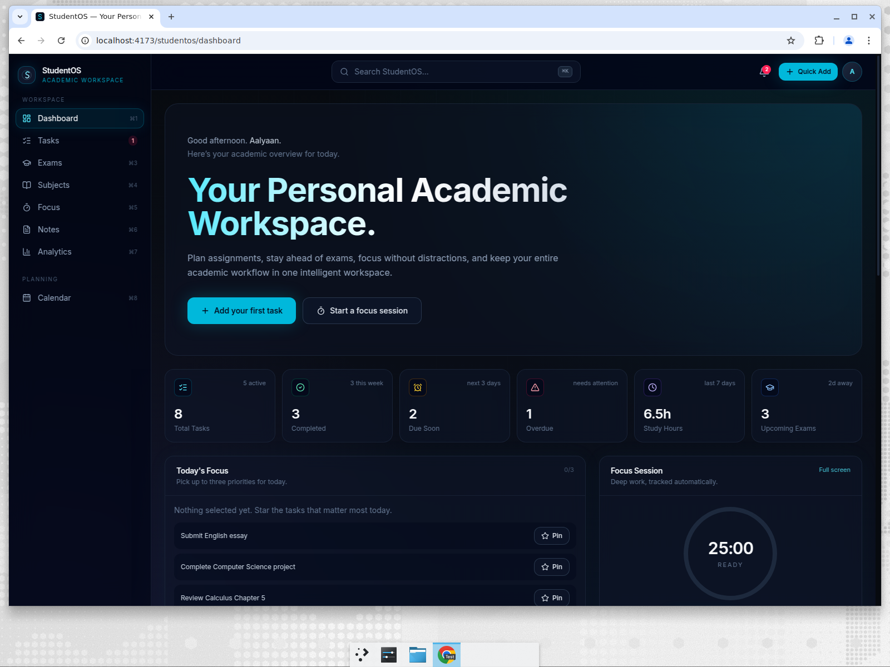

# StudentOS

**Your personal academic workspace.** StudentOS is a dark-first, keyboard-driven operating system for
student life: assignments, exams, subjects, notes, focus sessions, deadlines and study analytics in
one place. It runs entirely in the browser — no backend, no account, no data leaving your device.



> Screenshots live in `docs/`. Add your own captures there when the UI changes.

## Features

- **Dashboard** — greeting, live metrics (total / completed / due soon / overdue / study hours /
  upcoming exams), today's priorities, due-soon tasks, exam timeline, recent activity.
- **Tasks** — create, edit, complete, reopen and delete tasks with subject, priority, due date,
  description and tags. Filter by status/subject/priority, full-text search, four sort modes and a
  quick-add bar for rapid capture.
- **Exams** — countdowns with urgency states (normal / warning / urgent), preparation progress rings,
  location, notes, timeline view and search.
- **Subjects** — per-course cards with teacher, grade, accent colour, workload and progress.
- **Focus** — 25 / 50 / 90 / custom timers with start, pause, resume and reset. Sessions are logged
  against a subject or task and feed the study streak and analytics.
- **Notes** — pinned, searchable notes with subject and tags, edited in a focused modal.
- **Analytics** — study hours, completion rate, weekly focus bar chart, subject distribution donut,
  workload breakdown and a 5-week consistency heatmap for this week / month / semester.
- **Calendar** — today, week and month views combining tasks, exams and focus sessions.
- **Settings** — display name, density, reduced motion, reminder toggles, focus defaults, JSON export,
  sample-data reset and destructive clear with confirmation.
- **Command palette** (`⌘/Ctrl + K`) — search across tasks, exams, notes and subjects, and run actions
  such as creating a task or starting a focus session.
- **Everything persists** to `localStorage`, with a safe in-memory fallback when storage is blocked.

## Tech stack

| Layer | Choice |
| --- | --- |
| Framework | React 19 |
| Build tool | Vite 8 |
| Styling | Tailwind CSS 4 (`@tailwindcss/vite`) |
| Motion | Framer Motion |
| Icons | Lucide React |
| Routing | React Router 7 |
| Linting | Oxlint |

No state-management or charting libraries: the store is a small React context and the charts are
hand-written SVG.

## Getting started

```bash
git clone https://github.com/aalyaan2009/studentos.git
cd studentos
npm install
npm run dev
```

The dev server prints a local URL (Vite defaults to <http://localhost:5173/studentos/>).

### Scripts

| Script | Purpose |
| --- | --- |
| `npm run dev` | Start the Vite dev server |
| `npm run build` | Production build into `dist/` |
| `npm run preview` | Preview the production build locally |
| `npm run lint` | Run Oxlint over the project |
| `npm run deploy` | Build and publish `dist/` to the `gh-pages` branch |

## Deployment

`vite.config.js` sets `base: '/studentos/'` for GitHub Pages.

The quickest route is `npm run deploy`, which builds and publishes `dist/` to the `gh-pages` branch.

For CI-based deploys, copy `docs/github-pages-deploy.yml.example` to `.github/workflows/deploy.yml`.
It lints, builds, adds an SPA `404.html` fallback and publishes to GitHub Pages on every push to
`main`; enable **Settings → Pages → Source: GitHub Actions** once.

Deploying elsewhere (Vercel, Netlify, Cloudflare Pages): set `base` to `'/'`, build with
`npm run build` and serve `dist/` with a rewrite of all routes to `index.html`.

## Project structure

```text
src/
├── components/
│   ├── analytics/   Charts and stat tiles
│   ├── calendar/    Month grid
│   ├── dashboard/   Hero, metrics, priorities, streak, insights, activity
│   ├── exams/       Exam cards, modal, timeline
│   ├── focus/       Timer and session-complete modal
│   ├── layout/      AppShell, Sidebar, Topbar, MobileNav, CommandPalette
│   ├── notes/       Note cards and editor modal
│   ├── subjects/    Subject cards and modal
│   ├── tasks/       Task list, item, filters, quick add, modal
│   └── ui/          Button, Card, Badge, Input, Modal, Tabs, Toast, …
├── constants/       Navigation and design tokens
├── context/         AppContext (data) and UiContext (modals/palette)
├── data/            Seed data and default settings
├── hooks/           useLocalStorage, useTasks, useExams, useFocusTimer, shortcuts
├── pages/           One file per route
└── utils/           storage, dates, analytics, cn
```

## Data model

```js
Task    { id, title, description, subject, priority, dueDate, completed, completedAt, tags, createdAt }
Exam    { id, title, subject, date, time, location, progress, notes }
Subject { id, name, teacher, color, grade, progress }
Note    { id, title, content, subject, tags, pinned, updatedAt }
Session { id, minutes, subject, taskTitle, completedAt }
```

## Keyboard shortcuts

| Keys | Action |
| --- | --- |
| `⌘/Ctrl + K` | Command palette |
| `N` | New task |
| `T` / `E` / `F` | Tasks / Exams / Focus |
| `⌘/Ctrl + 1…8` | Jump to a page |
| `Esc` | Close the active dialog |

Shortcuts are ignored while typing in an input, textarea or select.

## Roadmap

- Optional cloud sync and multi-device accounts
- Recurring assignments and timetable import (ICS)
- Grade tracking with weighted assessments
- Pomodoro break cycles and ambient focus sounds
- Shared study groups and deadline sharing

## License

[MIT](LICENSE)
